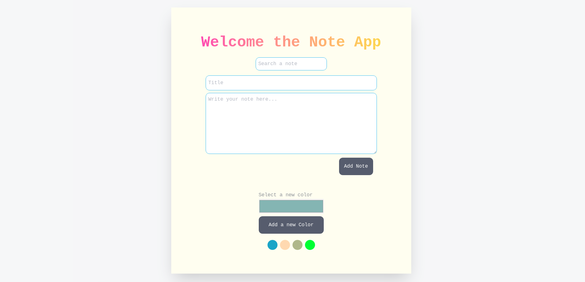
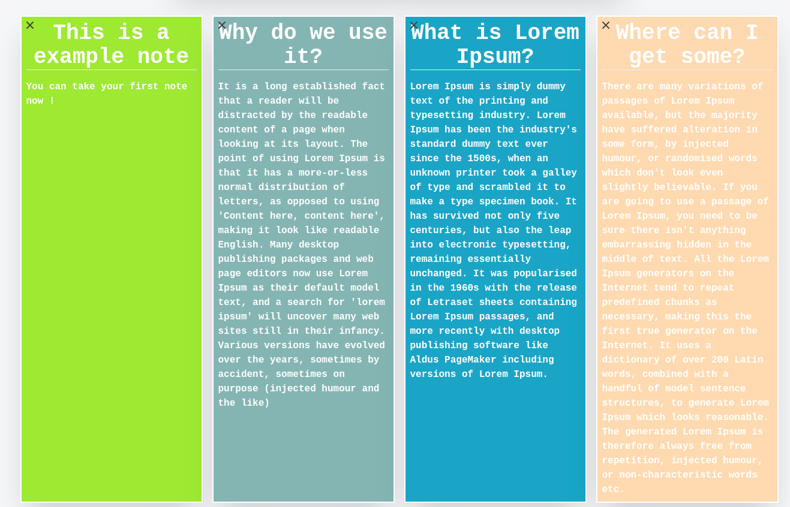

Patika.dev Note App
=

```javascript  

info = 
    {
    numberOfTask:1,
    module:"Redux",
    taskName:"Note App",
    frameworks:["React",`"Redux",`"Tailwind CSS"]
    }; 
```

#You can try here : https://note-app-redux.netlify.app/

### You can add a new note with different colors.

### You can filter your notes.


### You can add a new color for your notes.


